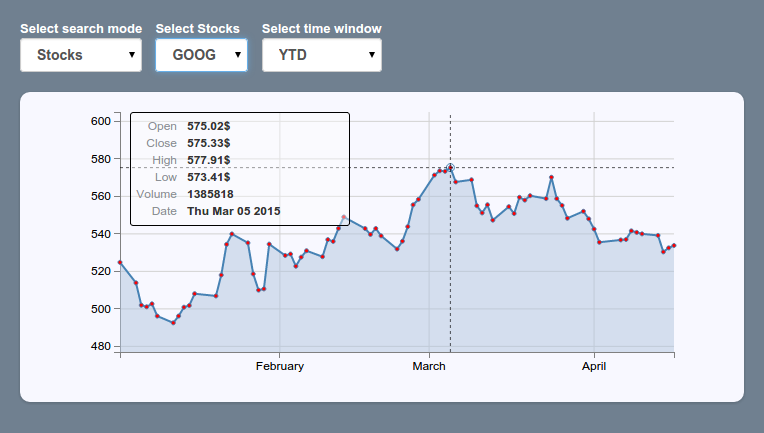
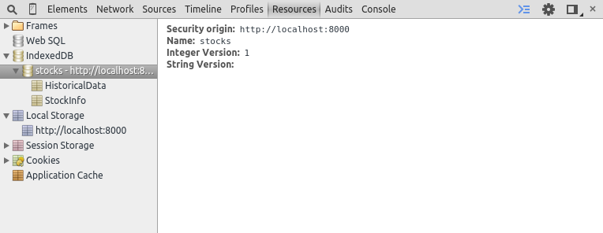
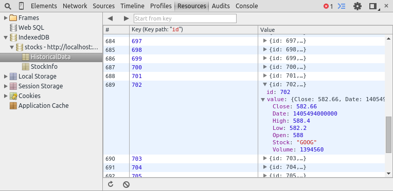
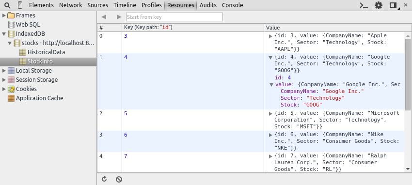
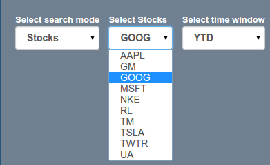
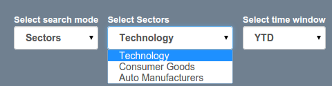

# Codelab overview
[Lovefield](https://github.com/google/lovefield) is an SQL-like, relational
query engine for the Web implemented in Javascript. In this codelab you will
build an offline-capable web application for analyzing stock market data.
You will use Lovefield as the data access layer and learn about its powerful
querying capabilities and intuitive API.

## What you'll learn
1. Setup steps for including Lovefield code in your application.
2. Defining the database schema.
3. Executing `INSERT` queries.
4. Executing simple `SELECT` queries (column projection, value predicates,
   sorting).
5. Executing complex `SELECT` queries (joins, aggregators, group by).
6. Debugging/examining a query.
7. Using parameterized queries.
8. Using database observers to trigger UI updates.

In short, you will learn why and how to use Lovefield in your next real-world
data-rich application, and you will gain a clear understanding of the
functionality Lovefield provides.

## What you'll need
- [NodeJS](https://nodejs.org/download/) and [gulp](
  https://www.npmjs.com/package/gulp).
- Chrome or Firefox.
- The `StockAnalyzer` skeleton code.
- A text editor

##Prerequisites

Basic familiarity with the concepts of [relational databases](
http://en.wikipedia.org/wiki/Relational_database) and the [relational data
model](http://en.wikipedia.org/wiki/Relational_model) is required to follow the
exercises of this codelab. Familiarity with [SQL (Structured Query Language)](
http://en.wikipedia.org/wiki/SQL) is not required, but is beneficial, especially
when it comes to advanced topics like *indexing* and *query optimization*.


# StockAnalyzer application overview

## UI overview
<br>

The application user interface has four components:

1. A drop down list populated with the available search modes, "Stocks" or
   "Sectors".
2. A drop down list populated with either stocks or industry sectors according
   to which search mode is selected.
3. A drop down list populated with various time windows. Options are *5 days*,
   *1 month*, *3 months*, *6 months*, *year-to-date (YTD)* and *1 year*.
4. A pane that displays query results as a 2D graph.


App users can search for "Stocks" or "Sectors" and specify a time window. The
result graph updates as users examine different stocks/sectors/time-windows.
Hovering over or touching the graph exposes additional information about a
specific date.


## Source code overview
**All Lovefield related code resides in lovefield\_service.js**, within a class
called `LovefieldService`. Everything else is already implemented and is not the
focus of this codelab.

|Filename                      |Description            |
|:-----------------------------|:----------------------|
|index.html                    | All HTML code.   |
|stock\_analyzer.css           | All CSS code.    |
|graph\_plotter.js             | Logic for drawing graphs. |
|fetcher\_service.js           | Logic related to fetching real-world stock market data from the network, using the Google Finance API.|
|query\_builder\_controller.js | AngularJS controller for interacting with all UI components related to building database queries.|
|lovefield\_service.js         | Class used by the rest of the application to make calls to Lovefield's API.<br>**This class is partially implemented. You will implement the remaining parts in this codelab.** |

## LovefieldService class
The application calls `LovefieldService` to fulfill its data-related needs.
The following methods are unimplemented or only partially implemented. Each of
them demonstrates a different part of Lovefield’s API, and you will implement
them in this codelab.


|Method name             |         Method description|
|:-----------------------|:--------------------------|
|`buildSchema`           |Builds the database schema.|
|`insertData`            |Inserts data fetched from the network to the database.|
|`getStockList`          |Retrieves the list of stocks for the "Stocks" search mode.|
|`getSectorList`         |Retrieves the list of sectors for the "Sectors" search mode.|
|`getStockClosingPrices` |Retrieves a given company's performance, within a given time window.|
|`getSectorClosingPrices`|Retrieves a given industry sector's performance, within a given time window.|
|`observeStockClosingPrices` |Registers an observer for the "stock closing prices" query.|
|`observeSectorClosingPrices`|Registers an observer for the "sector closing prices" query.|

One of Lovefield’s nicest features is its SQL-like API. Developers who are
already familiar with SQL will find learning Lovefield APIs straightforward. To
make it even easier, we're including the equivalent SQL queries for all steps in
this codelab.


# Step 0: Download and run the skeleton code
1. Clone the Github repository from the command line.
   `git clone https://github.com/google/lovefield.git`
2. Follow instructions in `lovefield/codelabs/stock_analyzer/README.md`.

## Codelab exercise answers
A different folder exists for the starting source code of each codelab step
(`src/step1/`, `src/step2/` ... and `src/final/`) such that you can pick
up the demo at any step. For example, if you want to pick up this codelab from
step4, you would start from the code residing at `src/step4`.

Also, **you can find the answer to any codelab exercise**, by inspecting the
next step's `lovefield_service.js` file. Note that simply looking at
`src/final/lovefield_service.js` might not help, since some methods are modified
twice within this codelab, which is why looking at the next step instead is
recommended.


# Step 1: Defining the database schema
In this step you are going to define the database schema used for holding the
data for the StockAnalyzer application. The database schema describes the
structure of the relational database. More specifically it describes:

- The tables in the database.
- The column names and data types for each table.
- Any constraints the database engine should enforce (primary-key, non-nullable,
  unique).
- Any indices the database engine should create in order to speed-up execution
  of certain queries.

The API entry point for defining the "schema" is [lf.schema.create()](
https://github.com/google/lovefield/blob/master/docs/spec/01_schema.md#lovefield-specification
), which in our case contains the two tables shown below.

## Table1: HistoricalData
This table stores historical data about stocks. Each record refers to a given
stock on a given day. For example:

```
{
  "Date": Thu Apr 10 2014 00:00:00 GMT-0700 (PDT), // Date
  "Open": 565,                                     // number
  "High": 565,                                     // number
  "Low": 539.9,                                    // number
  "Close": 540.95,                                 // number
  "Volume": 4027743,                               // integer
  "Stock": "GOOG"                                  // string
}
```

Note that No primary key exists on the `HistoricalData` table.

## Table2: StockInfo
This table stores information about each company. For example:

```
{
  "CompanyName": "Google Inc.",  // string
  "Sector": "Technology",        // string
  "Stock": "GOOG"                // string
}

```

Note that the "Stock" field is the primary key of the `StockInfo` table, which
means that it is also unique.

Take a look at how Javascript types map to Lovefield types in the [schema spec](
https://github.com/google/lovefield/blob/master/docs/spec/01_schema.md#131-columns)
and then go ahead and implement the `buildSchema_()` method on LovefieldService
class (search for `LovefieldService.prototype.buildSchema_` inside the
`lovefield_service.js` file). If you get stuck, you can take a look at
[Lovefield's "Quick Start"](
https://github.com/google/lovefield/blob/master/demos/todo/README.md) for some
help.

*Hints:*

1. Get a schema builder instance by calling `lf.schema.create()` (need to pass
   two parameters to this call).
2. Call `createTable('TableName')`, once for each table, to get a table builder instance
   and start calling methods on this instance to add columns to your table.
3. Return the schema builder instance from the `buildSchema_()` method.

If you are encountering problems finishing this step, take a look at the
complete answer
[here](https://github.com/google/lovefield/tree/master/codelabs/stock_analyzer/src/step2/lovefield_service.js#L77).

Once you've built the schema, reload the app and verify that the database has
been created using the developer tools in your browser.

For Chrome, navigate to **Resources > IndexedDB**. You should see a database
called "stocks" with two empty tables, as shown in the following screenshot.

For Firefox, you first need to enable the storage inspector by checking the
"Storage" checkbox in developer tools settings, see more
instructions [here](
https://developer.mozilla.org/en-US/docs/Tools/Tools_Toolbox#Settings).

<br>

## ConnectOptions
Let's take a look at the following code snippet which resides in
`LovefieldService#getDbConnection()` method.

```
var connectOptions = {storeType: lf.schema.DataStoreType.INDEXED_DB};
return this.buildSchema_().connect(connectOptions).then(
    function(db) { /* do something with db */ });
```

The optional `connectOptions` parameter specifies what kind of backing storage
to use for persisting the data. In this codelab we will use IndexedDB (which is
also the default value if `connectOptions` is omitted), so that the data is
persisted locally and it becomes inspectable by Chrome/Firefox's developer
tools.

An alternative (that will not be covered in this codelab) is to use
`lf.schema.DataStoreType.MEMORY` which would only store data in-memory (no
persisting). **This is a very powerful option since allows for leveraging
Lovefield’s querying API even if persisting data is not desired.**

## SQL equivalent
```
CREATE TABLE HistoricalData(
  Close FLOAT NOT NULL,
  Date DATE NOT NULL,
  High FLOAT NOT NULL,
  Low FLOAT NOT NULL,
  Open FLOAT NOT NULL,
  Stock VARCHAR(6) NOT NULL,
  Volume INTEGER NOT NULL);

CREATE TABLE StockInfo(
  CompanyName VARCHAR(30) NOT NULL,
  Sector VARCHAR(30) NOT NULL,
  Stock VARCHAR(6) NOT NULL,
  PRIMARY KEY (Stock));
```


# Step 2: Executing INSERT queries
In this step you will implement the `LovefieldService#insertData() method`. This
method is being called by the `FetcherService` class (already implemented) which
grabs the data by making network requests to the Google Finance API. The method
receives two Array parameters holding the raw data for each table. Take a look
at the Lovefield API for inserting rows on [the query builder docs](
https://github.com/google/lovefield/blob/master/docs/spec/04_query.md#42-insert-query-builder)
and populate both tables. You'll need to call `insert()`, not
`insertOrReplace()`, as the latter requires a table to have a primary key,
which is not the case for the `HistoricalData` table.

The raw rows are already converted to Lovefield rows within `insertData()`
method. by calling the `createRow()` method (specifically
`this.hd_.createRow(...)` and `this.si_.createRow(...)` respectively).

*Hints:*

1. Call `this.db_.insert()` and start forming the `INSERT` query.
2. Each `INSERT` query can only insert rows into a single table, so you 'll need
   to implemnt two such queries.

*Bonus exercise*: Populate both tables using a single database transaction.<br>
*Hint*: Read about the [difference of implicit vs explicit transactions](
https://github.com/google/lovefield/blob/master/docs/spec/05_transaction.md#52-implicit-transaction).

## Verify tables are populated correctly
Reload the app and verify in the developer tools that both tables have been
correctly populated. If the schema you created at the previous step is incorrect
(for example missing columns, or wrong types) it will not be detected until in
later steps (where spurious errors will be thrown).

Verify that the `HistoricalData` table is populated correctly.
Open the developer tools and **inspect a random record from the HistoricalData
table**. It should look as it does in the following screenshot. Make sure that all
the columns are present and that they have the correct types (also ensure that
there are no undefined/null values).

<br>

Now verify the same for the `StockInfo` table by comparing with the following
screenshot.

<br>

If the tables are not populated correctly, you will have to:

1. Fix the schema at the previous step (see the answer provided in the previous
   step, after the last hint).
2. Clear IndexedDB and rerun the application. In order to clear IndexedDB, you
   will have to select each of the tables and click on the "clear" icon next to
   the "round arrow" icon at the bottom of the developer tools window.
3. Re-run the application and verify that the tables are populated correctly
   this time.

You can move on to the next exercise, **only if you verified that both tables
are populated correctly**,

## SQL equivalent
Values shown in the SQL queries are purely for example purposes, your actual
code should have no hardcoded values, since it receives the data as a parameter.

```
INSERT INTO HistoricalData (Close, Date, High, Low, Open, Stock, Volume)
       VALUES (552.03, '30-Mar-15', 553.47, 548.17, 551.62, 'GOOG', 1281355),
              (123.03, '30-Mar-15', 153.47,  48.17, 151.62, 'AAPL', 362124);

INSERT INTO StockInfo (Stock, CompanyName, Sector)
       VALUES ('AAPL', 'Apple Inc.',             'Technology'),
              ('GM',   'General Motors Company', 'Auto Manufacturers'),
              ('GOOG', 'Google Inc.',            'Technology'),
              ('MSFT', 'Microsoft Corporation',  'Technology'),
              ('NKE',  'Nike Inc.',              'Consumer Goods'),
              ('RL',   'Ralph Lauren Corp.',     'Consumer Goods'),
              ('TM',   'Toyota Motor Corp.',     'Auto Manufacturers'),
              ('TSLA', 'Tesla Motors Inc.',      'Auto Manufacturers'),
              ('TWTR', 'Twitter Inc.',           'Technology'),
              ('UA',   'Under Armour Inc.',      'Consumer Goods');
```


# Step 3: Executing simple SELECT queries
In this step you are going to populate the sectors/stock drop-down list
depending on the current "search mode".

## Retrieving a list of all stocks
You can find the list of stocks in the StockInfo table's Stock column. Implement
the `LovefieldService#getStockList()` method by writing a query that retrieves
all rows from the `StockInfo` table and only keeps the `Stock` column.

Review the [SELECT Query Builder docs](
https://github.com/google/lovefield/blob/master/docs/spec/04_query.md#41-select-query-builder)
for information on writing SELECT queries,
and review the [filters docs](https://github.com/google/lovefield/blob/master/docs/spec/04_query.md#411-filters)
for information on selecting only the columns you're interested in.

*Hint:* You will need to pass the column to be kept as a parameter to the
`db.select()` method.

*Bonus exercise*: Modify the query to produce results in [sorted order](
https://github.com/google/lovefield/blob/master/docs/spec/04_query.md#414-limiters-and-order).

To verify that your query works,

1. Reload the app
2. Choose Stocks as the search mode
3. Click on the "Select Stocks" drop-down menu.

It should be populated with stock codes as shown in the following screenshot.

<br>

## Retrieving a list of industry sectors
Implement the `LovefieldService#getSectorList()` method by writing a query that
retrieves all (distinct) industry sectors. This query is similar to the previous
one as all the information resides in a single column of the StockInfo table.
But you have to use [an aggregation function](
https://github.com/google/lovefield/blob/master/docs/spec/04_query.md#415-group-by-and-aggregators)
to ensure that each industry sector is included only once in the result.

Once done, verify that the query works by switching to "Sectors" search mode and
clicking on the drop-down menu. It should be populated with three industry
sectors as shown in the following screenshot.

<br>

## SQL equivalent
```
SELECT Stock FROM StockInfo ORDER BY Stock ASC;
SELECT DISTINCT Sector FROM StockInfo ORDER BY Sector ASC;
```


# Step 4: Executing complex SELECT queries
## Retrieving closing values for a stock within a time window

In this step you are going to write a query to retrieve closing values for a
given stock within a given time window sorted by date in ascending order. The
information resides in the `HistoricalData` table's `Close` and `Date` columns.
Go ahead and implement `LovefieldService#getStockClosingPrices()`. This method
receives three parameters. `start`/`end` indicate the time window of interest,
`stock` indicates the stock to be analyzed. You will need to use all three
parameters to properly build the query. Make sure to review the information on
[how to construct predicates](
https://github.com/google/lovefield/blob/master/docs/spec/04_query.md#413-search-conditions).

*Hints*:

1. The query will have to include a `where()` clause.
2. You will need to combine multiple predicates using the `lf.op.and()`
   logical operator.
3. Constructing a predicate is done by using methods already provided on a
   column object like `eq()` and `between()`, see example snippet below.

```
var hd = db.getSchema().table('HistoricalData');
db.select().
    from(hd).
    where(lf.op.and(
        hd.Stock.eq(...),
        hd.Date.between(...)).
    exec();
```

Once done, verify that the query works. Reload the app, select "Stock" search
mode, and then select any stock from the drop down menu. Select various time
windows and the graph should update.

Voila! You can now start researching your next stock market moves!

# SQL equivalent
```
SELECT *
  FROM HistoricalData
  WHERE (Date BETWEEN '27-Mar-15' AND '30-Mar-15')
    AND Stock == 'GOOG'
  ORDER BY Date ASC;
```

## Retrieving average closing values for an industry sector within a time window
In this step you are going to write a query to retrieve average closing values
for a given industry sector within a given time window. The information resides
in two tables, which means that the query will have to join these two tables.
The association between stocks and industry sectors resides in the `StockInfo`
table, while the closing values for each stock resides in the `HistoricalData`
table.

Go ahead and implement `LovefieldService#getSectorClosingPrices()`.
Create a query that returns the average closing value for each date, taking into
account the closing values of all stocks that belong in the chosen sector,
sorted by date in ascending order. Make sure to review the information on
[grouping and aggregators](
https://github.com/google/lovefield/blob/master/docs/spec/04_query.md#415-group-by-and-aggregators).

*Hints:*

1. You will need to include a `groupBy()` clause.
2. You will need the `lf.fn.avg()` aggregator

Once done, verify that the query works. Reload the app, choose "Sectors" search
mode, and select any sector from the drop-down menu. The graph should update
accordingly.

## SQL equivalent
```
SELECT AVG(hd.Close), si.Sector, hd.Date
  FROM HistoricalData as hd, StockInfo as si
  WHERE hd.Stock == si.Stock
    AND (hd.Date BETWEEN '27-Mar-15' AND '30-Mar-15')
    AND si.Sector == 'Technology'
  GROUP BY si.Sector, hd.Date
  ORDER BY hd.Date ASC;
```


# Step 5: Debugging/examining a query
A common situation a developer faces when using a database query engine is a
query that

- returns unexpected results (with regards to the developer's
  expectations), or
- takes long time to execute.

The `explain()` method allows the developer to get an insider look on how the
query engine executes a given query, by returning the **execution plan** in a
human readable format. The execution plan is a detailed list of steps that the
database engine will perform in order to calculate the answer of a given query.

For example, let's examine the query performed by `getStockClosingPrices()`
which was implemented in the previous step and see whether we can improve its
execution plan. In order to do so, store the query in a local variable and print
out the result of the `explain()` method before executing it.


*Hint:*
```
var q = db.select(...).from(...).where(...);
console.log(q.explain());
return q.exec();
```

Reload the app, perform a stock search and observe the output in the console. It
should look similar to the following.

```
project()
-order_by(HistoricalData.Date ASC)
--select(value_pred(HistoricalData.Date between <value1>, <value2>))
---select(value_pred(HistoricalData.Stock eq GOOG))
----table_access(HistoricalData)
```

The execution plan is basically a tree data structure. Each node in the tree is
an operation. The plan is being executed from the bottom up. In our example the
following operations will take place.

1. **table\_access**: The entire `HistoricalData` table is brought into memory.
2. **select**: Rows that don't correspond to the GOOG stock are filtered out.
3. **select**: Rows that don't fall within the specified time window are
   filtered out.
4. **order\_by**: Remaining rows are sorted base on the `Date` field.
5. **project**: Columns that were not requested by the user are filtered out. In
   our case we requested all columns (by passing no params to `select()`) and
   therefore no columns are dropped.

The execution plan described above can be improved (in terms of performance), by
eliminating the need for a full table scan of the `HistoricalData` table. This
can be done by modifying the schema to create an index on the
`HistoricalData#Stock` column. Go ahead and modify the
`LovefieldService#buildSchema()` method by adding the proposed index.  If you
get stuck, you can take a look at [Lovefield's "Quick Start"](
https://github.com/google/lovefield/blob/master/demos/todo/README.md)
for an example schema definition that uses an index.

Once done reload the app and re-examine the execution plan. It should now look
as follows.

```
project()
-order_by(HistoricalData.Date ASC)
--select(value_pred(HistoricalData.Date between <value1>, <value2>))
---table_access_by_row_id(HistoricalData)
----index_range_scan(HistoricalData.idx_stock, [GOOG, GOOG], natural)
```

Notice how there is no `table_access` operation anymore and the first `select`
is also missing. Instead, an `index_range_scan` operation has shown up.
The database engine is utilizing the index we just added to retrieve only those
`HistoricalData` rows that correspond to the GOOG stock, eliminating the need
for for a full table scan, followed by a filtering of rows that don't correspond
to the given stock. Optimizations like this one can make a huge difference on a
real-world application.


# Step 6: Using parameterized queries
Parameterized queries are queries where placeholders are used for some values.
Before such a query can be executed all placeholders must be assigned a value.
Most modern database engines support this feature, although it might be
advertised using a different name (for example "prepared statements" or "query
templates").

The advantage of this approach is that under the covers the database engine will
*generate an execution plan only once and reuse it many times*. The overhead of
generating an execution plan can be significant for queries that are executed
multiple times.

In our application there are two queries that are executed multiple times with
different values each time and therefore they could be parameterized.
Specifically the queries that are executed in methods `getStockClosingPrices()`
and `getSectorClosingPrices()` are receiving three parameters each. Go ahead and 

1. Take a look at [Lovefield's parameterized query API](
   https://github.com/google/lovefield/blob/master/docs/spec/04_query.md#45-parameterized-query).
2. Modify those methods such that instead of creating a brand new query every on
   every invocation, they are using simply re-using an existing query template.

*Hints:*

1. Create the parametrized queries using the `lf.bind()` method to generate
   placeholders, within the `LovefieldService#onConnected_` method. You can
   simply copy the queries to be parameterized, and replace `start`, `end`,
   `stock` and `sector` with calls to `lf.bind()`.
2. Modify both `getStockClosingPrices()` and `getSectorClosingPrices()` to refer
   to the parametrized queries you just created (see example snippet below).

```
return this.myParameterizedQuery_.bind([value1, value2, ...]).exec();
```

Once done reload the app and ensure that both stock end sector search modes
still work.


# Step 7: Using query observers to update UI

## The basics
A query observer is a function that gets called whenever the results of a given
query are modified. Lovefield provides a very powerful DB observing mechanism
via the [db.observe()](
https://github.com/google/lovefield/blob/master/docs/spec/04_query.md#46-observers)
method. In short, any SELECT query can be observed, such that every time the
results of that query are modified, observers get notified with a detailed list
of the changes that happened. The information that is passed to observers is
inspired by the [Array.observe() API](
https://developer.mozilla.org/en-US/docs/Web/JavaScript/Reference/Global_Objects/Array/observe).
The **two** most common scenarios triggering observers are listed below.

## Observer triggered by data modification
The database is modified by `UPDATE`, `INSERT` or `DELETE` queries. For example
consider the following snippet

```
var si = db.getSchema().getTable('StockInfo');
// Getting a list of all stocks (implemented at step 3 earlier).
var q = db.select(si.Stock).from(si);
db.observe(q, function(changes) { console.log(changes); });

var stockInfoRow = si.createRow({
  CompanyName: 'Toyota Motor Corp',
  Sector: 'Auto Manufacturers',
  Stock: 'TM'
});

// Inserting a new row into the StockInfo table, which will trigger the
// observer registered above.
db.insert().into(si).values([stockInfoRow]).exec();
```

It is worth noting that the observer is triggered *only* if the results of the
observed query are modified. Also the `changes` object passed to the
callback includes a detailed list of changes (additions/deletions).

## Observer triggered by parameterized query.
Query observers can be combined with parameterizable queries as shown below.

```
var si = db.getSchema().getTable('StockInfo');

// Find the name of a company given its stock code ('GOOG', 'TSLA' etc).
var q = db.
  select(si.CompanyName).
  from(si).
  where(si.Stock.eq(lf.bind(0)));

db.observe(q, function(changes) { console.log(changes); });

q.bind(['GOOG']).exec(); // Triggers the observer.
q.bind(['TSLA']).exec(); // Triggers the observer.
```

In the above example, even though no modification happened to the database, the
observer gets triggered because a parameter of the observed query was bound to
a different value (which causes the result of this query to be changed).

## Utilizing query observers to update the UI
In our example application we are already using two parameterized queries
(implemented at step 6), but the app is currently not using observers to update
the UI. In this exercise the app will be modified to use DB observers to update
the UI as the user is making different selections in the available drop down
lists. The instructions below will guide you through this process.

For this exercise two files need to be modified, `lovefield_service.js` and
`query_builder_controller.js`.

1. Implement the already provided stub methods  `observeStockClosingPrices` and
   `observeSectorClosingPrices` in `lovefield_service.js`.<br>
   *Hint*: Use `db.observe()` method.
2. Implement the already provided stub method `startObserving_()` in
   `query_builder_controller.js`, such that it registers two observers (use the
   methods implemented at the previous instruction). Within each observer, call
   `updateStockGraph_` and `updateSectorGraph_` respectively.<br>
   *Hint*: Given that we will be redrawing the entire graph from scratch, there
   is no need to deal with additions/deletions in the changes parameter that is
   passed to the observers. Simply grab the final result as
   ```var plotData = changes[0].object; // Similar to Array.observe.```
3. Inspect the `search()` method in query_builder_controller.js. You will notice
   that it calls `getStockClosingPrices` and `getSectorClosingPrices` from the
   `LovefieldService` class and once the results are available it explicitly
   makes a call to update the UI. This is no longer necessary since our
   observers will perform this task, therefore delete both occurrences of
   promise callbacks `then(...)`.
4. Final step is to call the `startObserving_()` method in the constructor of
   `QueryBuilderController`. Place this call right before the call to
   `getStockList()`.

Reload the app and start interacting with the UI. Everything should be working
as before, only this time query observers are utilized to update the UI.

*Performance note*: Registering DB observers imposes a cost on the overall
system, so in a real-world scenario observers that are not needed anymore
should be unregistered. For example we could unregister the "stock" observer
when in "sector" search mode, and re-register it when the user switches back to
"stock" mode. Similarly for the "sector" observer.

# Congratulations
Your web application is now successfully utilizing Lovefield as its data layer.

## What we've covered
1. Creating a database schema and opening a connection to the database.
2. Executing `INSERT` queries, explicit/implicit transactions.
3. Executing `SELECT` queries, specifying column filtering, simple and composite
   predicates, joining, grouping, sorting.
4. Inspecting the execution plan of a query. Debugging slow queries.
5. Parameterized queries (re-using queries by binding parameters to different
   values).
6. Observing queries (getting notified every time the results of a given query
   change).

## Next Steps
There are more useful Lovefield features that were not covered in this codelab.

- Using [aliases](
  https://github.com/google/lovefield/blob/master/docs/spec/04_query.md#416-column-aliases)
  for tables and columns.
- Using [LIMIT and SKIP](
  https://github.com/google/lovefield/blob/master/docs/spec/04_query.md#414-limiters-and-order)
  to retrieve only a subset of the results.
- Declaring [constraints](
  https://github.com/google/lovefield/blob/master/docs/spec/01_schema.md#132-constraints)
  (unique/non-unique, nullable/non-nullable).
- [Using MemoryDb](
  https://github.com/google/lovefield/blob/master/docs/spec/03_life_of_db.md#311-connect-options)
  instead of IndexedDb as the backing store (useful for testing, but also for
  cases where data persistence is not desired).
- [Executing UPDATE queries](
  https://github.com/google/lovefield/blob/master/docs/spec/04_query.md#43-update-query-builder)
  (updating specific columns while leaving other columns unaffected).
- [Performing schema upgrades](
  https://github.com/google/lovefield/blob/master/docs/spec/03_life_of_db.md#33-database-upgrade)
  (adding tables/columns/indices to existing databases).

If you would like to find out more about Lovefield please see the [full
developer documentation](https://github.com/google/lovefield/tree/master/docs/spec).
You can post questions/comments at our [public discussion
forum](https://groups.google.com/forum/#!forum/lovefield-users) and file bugs at
our [issue tracker](https://github.com/google/lovefield/issues).
