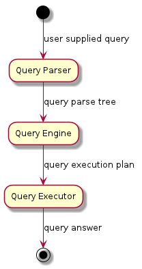
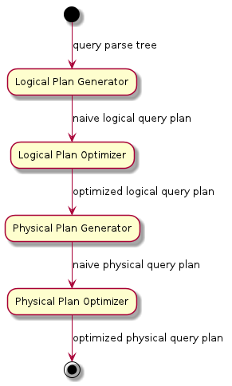
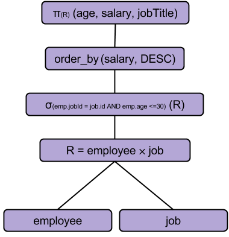
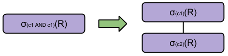
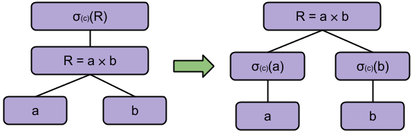
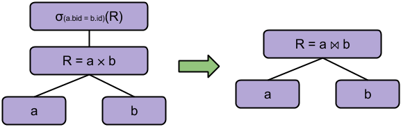
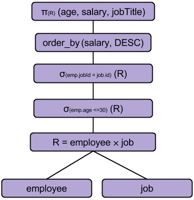
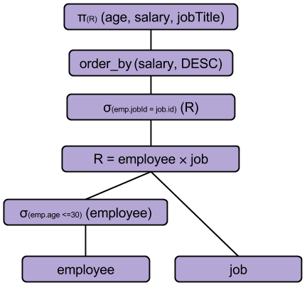
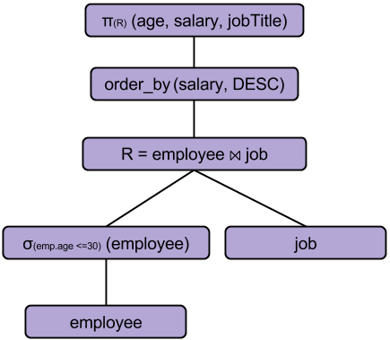
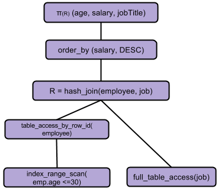

# Introduction
  Lovefield is a relational database management system for the web, built on
top of IndexedDB. It includes a relational query engine that does not exhibit
WebSQL's security vulnerabilities, and closely resembles SQL such that there is
almost no learning curve for developers.

## Why is Lovefield needed?
  Simply put, because there is no relational query engine available for the
web, since WebSQL was deprecated.

## Comparison with IndexedDB
  IndexedDB is a lower level API than what most web developers are looking for
from a database solution. Our team realized this the hard way, after working
with IDB for almost two years for the purposes of the Google+ Photos Chrome
application.

  IDB is lacking a critical component of a proper database framework, a query
layer. Performing typical **SELECT..FROM..WHERE** queries quickly reveals this
deficiency by the fact that the resulting code to achieve such a query is
surprisingly long and unintuitive. A more accurate way of describing IDB is as
"an object store with some minimal database features like indices and cursors".
The solution of the team for the lack of querying functionality was to build a
domain specific query layer between IDB and the rest of the application. The
complexity of such queries was nicely hidden within that intermediate layer,
but that layer took a lot of resources to develop and maintain, while solving
the data access needs of this particular application only.

  Lovefield is using IDB purely as the backing store. Any persistence API could
be used as the backing store for Lovefield, but at the time of this writing the
only viable cross-browser solution is IDB.

## Overview: Life of a query
  The following diagram shows a high level view of the entire system. First a
query is submitted by the user. The query is parsed/validated and a tree data
structure is generated (query parse tree). The query tree is then passed to the
query engine which is responsible for coming up with an execution plan (query
execution plan). The selected plan is finally passed to the query executor
which executes it and produces the result.

<br>
Figure 1: Life of a query overview.

The focus of this design document lies on the Query Engine itself, which is
composed of the following sub-components.

* logical plan generator
* logical plan optimizer
* physical plan generator
* physical plan optimizer

The relation of those subcomponents is depicted in the following diagram.

<br>
Figure 2: Query engine subcomponents.

  In the following sections each component will be analyzed in detail. In doing
so it is easier to use an example database schema throughout those sections, as
well as an example database query
### Example database schema
```
Employee(id, festoon, Liston, salary, age, jobId)
Job(id, title, minSalary, maxSalary)
```
### Example query
```
SELECT   job.title, employee.age, employee.salary
FROM     employee, job
WHERE    employee.jobId == job.id AND
         employee.age <= 30
ORDER BY employee.salary DESC
```

## Logical plan generator
  The logical plan generator converts the query parse tree to a relational
algebra tree. The conversion is draft, which means that the resulting logical
plan is not optimized. The following diagram shows the draft logical plan for
the example query.

<br>
Figure 3: Example draft plan.

where

* σ<sub>c</sub>(R) denotes a selection operation on relation R based on the
condition c.
* π(R)(a<sub>1</sub>, a<sub>2</sub> …. a<sub>N</sub>) denotes a projection
operation on relation R using all attributes in set {a<sub>i</sub>}.
* R<sub>1</sub> ⨯ R<sub>2</sub> denotes the cross product operation.

### Why optimization is important?
  Evaluating a query execution plan from a performance perspective is
influenced mainly from two quantities.

1. The amount of time elapsed between the moment the query was submitted and
the moment the query answer was produced (query execution time).
2. The amount of CPU memory needed during query execution.

  Query execution time strongly depends on how many times the backing store
(disk) has to be accessed during query execution. Accessing the disk is a slow
operation (especially when referring to traditional hard disks with moving
parts). Therefore minimizing disk access operations leads to improved query
execution time. The most widely used techniques for eliminating the need for
disk access is in-memory indices and usage of a smart caching layer.

  Memory CPU usage depends on the size of intermediate results that are
calculated before the final answer is reached. Therefore minimizing the size of
intermediate results improves overall memory performance (but also improves
query execution time as points 1 and 2 above are not completely independent).

  Disk access is not a notion that belongs to relational algebra and therefore
it is taken into account later in the process (see Physical plan optimizer
section). On the other hand, reducing the size of intermediate results is
partly addressed when choosing a logical query plan, as shown in the following
section.

## Logical plan optimizer
  The logical plan optimizer converts a draft logical query plan to an
equivalent logical plan that performs better than the original one. In the
example draft plan of Figure 3 note that the two relations are combined using a
cross product operator. Cross product is a very expensive operation since it
produces N \* M results where N, M represent the size of the relations that are
involved respectively. It will be shown below how the logical plan optimizer
will replace this expensive operation with a different more efficient operation
(both in terms of memory and CPU usage).

  Also note that a logical query plan only specifies the relational algebra
operators needed in order to calculate the result, but it does not specify the
implementation of those operators. Implementation is chosen when a physical
query plan is generated in later stages.

  The logical plan optimizer is a rule-based optimizer (as opposed to a
cost-based one), which means that it applies a set of heuristic rules on the
logical query plan in order to improve it, without taking into account the
actual data residing in the backing store. Optimization is essentially a series
of transformations (optimization passes) applied in a specific order. Each
transformation on the logical query plan is based on a relational algebra
equivalence rule, such that the transformation does not affect the result of
the query but only the way that result is calculated.

  An optimization pass is a search operation on the tree, looking for a
specific structural pattern. If the pattern is found it is replaced with
another equivalent pattern. There are currently three optimization passes
performed, each one responsible for a different type of transformation.

### AndPredicatePass
  In this pass, AND predicates are broken down to standalone predicates This
pass on its own does not achieve any performance gains but it  is necessary
such that follow-up optimizations passes can be applied.

<br>
Figure 4: AndPredicatePass transformation.

  In Figure 4 an example of this pass is shown. The composite AND condition on
the left has been transformed to two separate nodes with a parent child
relationship. The resulting tree is equivalent to the original one.

### PushDownSelectionsPass
  In this pass, selection nodes are being pushed downwards as much as possible.
This transformation exhibits two significant performance gains,

1. The intermediate results are being filtered down sooner rather than later,
which results in less memory needed to hold the results.
2. Subsequent operations (higher up in the tree) are operating on a smaller
result
set which allows them to be executed faster.

<br>
Figure 5: PushDownSelectionsPass transformation.

Note that the selection condition C might not apply to both relations a and b.
In such case it will be pushed down only where it applies.

### ImplicitJoinsPass
  In this pass, implicit joins are being detected. An implicit join appears in
the tree as two separate nodes, a selection node on a foreign key followed by a
cross product node (the two nodes don't have to be directly connected for the
optimization pass to apply).

<br>
Figure 6: ImplicitJoinsPass transformation.

where the ⨝ symbol denotes a join operation on a the given condition.

### Logical query plan optimization example

  The optimization passes described earlier can be applied to the example draft
logical plan displayed in Figure 3. On the left, the **AndPredicatePass** has
been
applied to the draft logical plan and resulted in the composite selection node
to be broken to two separate nodes. On the right the **PushDownSelectionsPass**
has
been applied, which managed to push down only the selection node that refers to
the employee relation. The other selection node refers to both relations and
therefore could not be pushed below the cross product node.

<br>
Figure 7a: Logical query plan optimization example after AndPredicatePass
transformation has been applied.

<br>
Figure 7b:Logical query plan optimization example after PushDownSelectionsPass
transformation has been applied.

<br>
Figure 7c: Logical query plan optimization example after ImplicitJoinsPass
transformation has been applied.

On Figure 7(c) the **ImplicitJoinsPass** has been applied, which resulted in the
selection node and the cross product node to be combined into a single join
node (equi-join). The final logical query plan differs significantly from the
initial draft tree, even though both trees represent the same query.

## Physical plan generator

  The physical plan generator converts a logical plan to a physical plan. As
explained earlier, the logical query plan does not specify the implementation
of the relational algebra operations. For example when executing a join
operation there are many candidate join algorithms that can be used, such as
hash-join, nested-loop-join etc. Also logical query plan does not specify the
way the backstore is accessed and has no notion of any available in-memory
indices.

  A physical query plan on the other hand, describes completely how to execute
each involved operation and can capture data access operations such as

* full table access
* table access by row ID
* index range scan

  The responsibility of the physical plan generator is to generate a draft
physical plan. Similarly to the logical plan case, optimization is handled by a
different component. In the following diagram the physical query plan generated
from  the logical plan of Figure 7(c) is displayed.

<br>
Figure 8: Draft physical query plan.

  By reading the physical query plan from bottom to top order we see that

1. First, the employee and job tables will be fully read into memory.
2. The employee rows will be filtered by a predicate on the employee’s age.
3. The remaining employee rows will be joined with all the rows in the job
table.
4. The results will be sorted based on salary, and finally
5. Only fields age, salary and jobTitle will be kept.

## Physical plan optimizer
  The physical plan optimizer converts a physical plan to an equivalent more
efficient physical plan. When choosing a physical query plan, the notion of a
“cost” is used, and therefore this optimization is characterized as
cost-based. Calculating the cost of a query can be a subject of its own, but
for Lovefield’s purposes the cost is basically affected by the following
factors

1. the amount of data brought to memory from the backing store.
2. the size of the results of intermediate operations.
3. the run-time complexity of the algorithms involved.

  Regarding 3, some relational algebra operators’ implementation has already
been chosen during physical plan generation. For example note in Figure 8 that
the hash_join node has been chosen instead of a nested_loop_join, since the
join condition involves the equality operator and therefore the join can be
calculated in O(M+N) time instead of O(M\*N), where M, N are the sizes of the
two involved tables respectively. Factor 2 has already been addressed during
logical plan optimization (by pushing selections downwards in the tree). Factor
1 is addressed by the IndexRangeScanPass described in the following section.

### IndexRangeScanPass
  In this pass, the objective is to minimize the amount of disk accesses
needed. Dumping an entire table into memory (full_table_scan) requires multiple
disk accesses. The exact number depends on the way the table is stored into
physical blocks in the underlying filesystem.

  Indices can be leveraged as a way to eliminate the need to access the backing
store, since indices are already loaded into memory they are much faster to
access.

<br>
Figure 9: IndexRangeScanPass transformation.

  In Figure 9, there are two selection nodes on top of a full table access
node. If any indices exist for the attributes involved in c<sub>1</sub> and/or
c<sub>2</sub>, then the full table access can be avoided by using one of those
indices. The most selective index will be used in the case of more than one
available indices. An index_range_scan step will return the row IDs of the
rows that satisfy a given condition. Then the table_access_by_row_id step will
only bring those rows into memory instead of the entire table.

### Physical query plan optimization example
  The optimization process described earlier can be applied to the example
logical plan displayed in Figure 7c. After optimization the final physical
query plan looks as follows.

<br>
Figure 10: Optimized physical query plan.

## Future work
  The optimizations mentioned above are a good starting point, but there is
room for even more performance gains in the future. Further optimization
efforts can be broken down to two main categories.

### Minimize pre-execution overhead
A portion of the overall query execution time is spent to convert a query parse
tree to an optimized physical query plan. This time can be further minimized as
follows

* *Re-use query execution plans*. In the case where the same query is performed
multiple times, it makes sense to calculate the physical query plan once and
short-circuit the entire process by reusing a previously generated plan.
* *Be smarter about which optimization passes to attempt*. Some optimization
passes
end up not modifying the logical query plan, because the pattern they are
looking for is not found in the tree. In some cases, it can be determined that
an optimization pass will not have any effect on the tree, without having to
traverse the entire tree.

### Minimize actual execution time
There are more optimizations that can be done in the physical query plan tree.

* In the case where ORDER BY is used, indices can be leveraged to start from  a
sorted row set and avoid the need to perform a sorting operation. Currently
ORDER BY is not leveraging any available indices.
* Implement more join algorithms and dynamically choose the best one. Currently
only two join algorithms have been implemented, hash-join and nested-loop join.
* Research more physical query plan optimizations.
