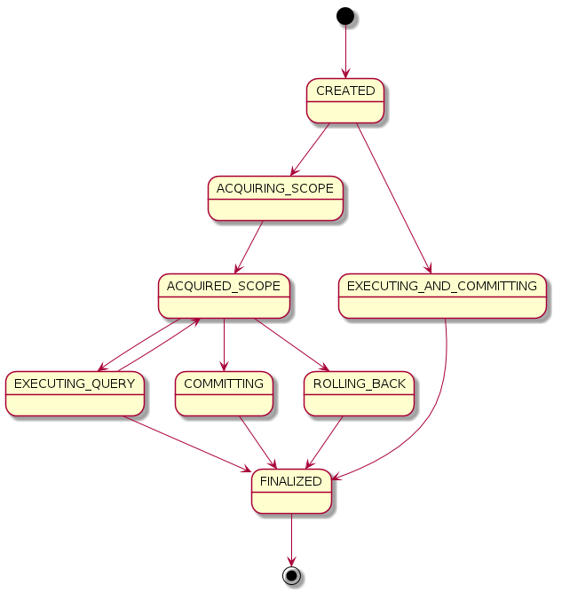

# Lovefield Design Document

## 5. Transaction

A transaction is an atomic unit of execution that guarantees all queries inside
this transaction to be committed as a whole, or none get committed.
Function-wise, transactions are either read-only or read-write; Syntax-wise,
transactions can be implicit or explicit. The concurrency control model for
transactions is already [defined in the spec](
../spec/05_transaction.md#54-concurrency-control).


### 5.1 Transaction Creation

Implicit transactions are created when `exec()` of a query builder is called.
For example:

```js
db.select().from(job).exec();  // Implicit read-only transaction.
db.insert().into(job).values(rows).exec();  // Implicit read-write transaction.
```

Multiple implicit transactions will exhibit worse performance than a single
explicit transaction. Users are encouraged to group their write operations to
as few transactions as possible, for better performance.

All read-only transactions in Lovefield are implicit transactions created by
`SELECT` queries' `exec()` method. It will lock the scoped tables with shared
lock.

All explicit transactions are read-write transactions created by
`createTransaction()`. For example:

```js
var tx = db.createTransaction();
```

The scope of the transaction must be specified explicitly:

* Using the `exec()` method, where Lovefield can calculate the table scope
  by parsing query, OR
* Using the `begin()` method to explicitly specify the table scope.

The transaction will place reserved locks on all involving tables to prevent
other writers from polluting its snapshot.

### 5.2 Transaction Execution

A transaction has following states in its lifecycle:

1. Initial state (`CREATED`)
2. Acquiring scope (`ACQUIRING_SCOPE`): getting proper lock from lock manager
   for tables involved
3. Acquired scope (`ACQUIRED_SCOPE`): proper locks have granted
4. Execute (`EXECUTING_QUERY`): executing a single query
5. Execute Transaction (`EXECUTING_AND_COMMITTING`): immediately executing a
   transaction
6. Committing (`COMMITTING`)
7. Rolling back (`ROLLING_BACK`)
8. Finalized (`FINALIZED`): end of execution

The state transitions is illustrated below:
<br/>
Figure 1: Transaction state transition

When a transaction is created, it will be in the `CREATED` state, and an
associated `TransactionTask` or `UserQueryTask` will be created. A `Task` is an
execution unit in `Runner`, which will be discussed later. The task will be
scheduled to runner's execution queue and waiting for execution.

Since the transaction has two execution patterns, there are two different sets
of state transition to match both patterns:

* If the transaction is invoked in this way `tx.exec([builder1, builder2, ...])`
  then the `EXECUTING_AND_COMMITTING` route will be selected because the syntax
  implicitly indicates auto-commit. In this case the transaction is represented
  as `UserQueryTask` with multiple task items.

* If the transaction is invoked in `tx.begin(); tx.attach(...); tx.commit();`
  pattern, then the `ACQUIRING_SCOPE` route will be used, since the user wants
  fine-grained control over the transaction's commit/rollback. In this case the
  transaction is represented as `TransactionTask`.


### 5.3 Runner

The core logic of runner is to schedule and run tasks in correct order. Each
task is an atomic executing unit (a.k.a. logical transaction), and has a scope.
Lovefield allows multiple concurrent readers for a given table, until a writer
asks to lock the table. Based on scopes, runner will arrange the execution order
of tasks, and attempt to concurrently execute as many transactions as possible.

Besides scope operations, Task objects are also used to implement observing
SELECT queries. When a SELECT query is been observed, the tasks will check if
that query needs to be re-run provided that the query's scope has changes, or
the query had been bound to different set of parameters.

All observers are stored in global `ObserverRegistry`, which is a map of
queries to their observers. Observers are triggered in the following two cases:

* When the observed scope has changed.
* When a table belonging to the observed scope has been modified.

When runner finished any task, it will check whether the finished task altered
the scope of observed queries. If so, runner will schedule those queries as
immediate tasks. Also, runner will check whether the bound values has changed
from last seen (if any). If so, run the snapshot diff logic and trigger observer
accordingly. The immediate observer task will effectively delay all pending
tasks, just like `TRIGGER` in other DBMS system. Users are responsible for
embracing possible performance hit and planning ahead.

#### 5.3.1 Different Runner Tasks

| Type            | Priority (lower number means higher priority) |
|-----------------|-----------------------------------------------|
| Export          | 0                                             |
| Import          | 0                                             |
| Observer Query  | 0                                             |
| External Change | 1                                             |
| User Query      | 2                                             |
| Transaction     | 2                                             |

The runner implements a priority queue so that higher priority tasks will
preempt lower ones and be executed first.

There are two special tasks, `ImportTask` and `ExportTask`, that is specialized
in importing data into an empty database, or exporting all data of current
database into a JavaScript object. These two tasks have the highest priority of
all and will lock down all tables.

### 5.4 Journal

The atomicity of a transaction is guaranteed by `Journal`, which serves as
an in-memory snapshot of transaction execution states. When a transaction is
executed, the physical plans of queries inside it will be executed one-by-one.
For physical plans that need to change database contents, these changes are
staged inside Journal. When all the plans are executed, a diff between
post-transaction and pre-transaction states will be generated, and flushed into
data store. Lovefield assumes data store provides atomic writing, i.e. this
writing will be guaranteed to be all-success or all-fail, and hence the
transaction is committed or rolled back.
